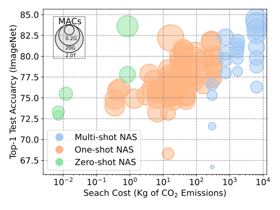

# survey-zero-shot-nas

<figure>

<figcaption align = "center"><b>Fig.1 - Comparision of various NAS approaches</b></figcaption>
</figure>


## Paper list of zero-shot NAS
- [Zero-Cost Proxies for Lightweight NAS](https://arxiv.org/abs/2101.08134)
- [Unifying and Boosting Gradient-Based Training-Free Neural Architecture Search](https://arxiv.org/abs/2201.09785)
- [LiteTransformerSearch: Training-free On-device Search for Efficient Autoregressive Language Models](https://arxiv.org/abs/2203.02094)
- [Training-free Transformer Architecture Search](https://openaccess.thecvf.com/content/CVPR2022/html/Zhou_Training-Free_Transformer_Architecture_Search_CVPR_2022_paper.html)
- [Training-Free Hardware-Aware Neural Architecture Search with Reinforcement Learning](https://koreascience.kr/article/JAKO202103953762146.pdf)
- [Understanding and Accelerating Neural Architecture Search with Training-Free and Theory-Grounded Metrics](https://arxiv.org/abs/2108.11939)
- [A Feature Fusion Based Indicator for Training-Free Neural Architecture Search](https://ieeexplore.ieee.org/abstract/document/9548935)
- [Neural Architecture Search without Training](https://proceedings.mlr.press/v139/mellor21a.html)
- [Zen-NAS: A Zero-Shot NAS for High-Performance Deep Image Recognition](https://openaccess.thecvf.com/content/ICCV2021/html/Lin_Zen-NAS_A_Zero-Shot_NAS_for_High-Performance_Image_Recognition_ICCV_2021_paper.html)
- [Revisiting Efficient Object Detection Backbones from Zero-Shot Neural Architecture Search](https://arxiv.org/abs/2111.13336)
- [A Training-Free Genetic Neural Architecture Search](https://dl.acm.org/doi/abs/10.1145/3491396.3506510)
- [EcoNAS: Finding Proxies for Economical Neural Architecture Search](https://openaccess.thecvf.com/content_CVPR_2020/html/Zhou_EcoNAS_Finding_Proxies_for_Economical_Neural_Architecture_Search_CVPR_2020_paper.html)
- [EPE-NAS: Efficient Performance Estimation Without Training for Neural Architecture Search](https://link.springer.com/chapter/10.1007/978-3-030-86383-8_44)
- [How does topology influence gradient propagation and model performance of deep networks with DenseNet-type skip connections?]()
- [FLASH: Fast Neural Architecture Search with Hardware Optimization](https://dl.acm.org/doi/abs/10.1145/3476994)
- [Deep Architecture Connectivity Matters for Its Convergence: A Fine-Grained Analysis](https://arxiv.org/abs/2205.05662)
- [Reducing Neural Architecture Search Spaces with Training-Free Statistics and Computational Graph Clustering](https://arxiv.org/pdf/2204.14103.pdf)
- [EZNAS: Evolving Zero-Cost Proxies For Neural Architecture Scoring ](https://openreview.net/forum?id=lSqaDG4dvdt)
- [Zero-Cost Proxies Meet Differentiable Architecture Search](https://arxiv.org/abs/2106.06799)
- [Neural Architecture Search on ImageNet in Four GPU Hours: A Theoretically Inspired Perspective](https://arxiv.org/abs/2102.11535)
- [Training-Free Multi-objective Evolutionary Neural Architecture Search via Neural Tangent Kernel and Number of Linear Regions](https://link.springer.com/chapter/10.1007/978-3-030-92270-2_29)
- [Extensible Proxy for Efficient NAS](https://arxiv.org/abs/2210.09459)
- [ZiCo: Zero-shot NAS via Inverse Coefficient of Variation on Gradients](https://arxiv.org/abs/2301.11300)


## How to use this repo
This repo is designed to evaluate different zero-shot proxied for various benchmarks.

### Install
```pip install -r requirement.txt
git clone https://github.com/google-research/nasbench
cd nasbench
```
In the `nasbench` folder, you need to modify `import tensorflow as tf` into `import tensorflow.compat.v1 as tf` for the following files：
```example.py
   nasbench/api.py
   nasbench/lib/evaluate.py
   nasbench/lib/training_time.py
```
Then install `nasbench`
`pip install -e .`
### Data and Benchmark download
Go to `~/dataset/img16/ImageNet16/`
- Download ImageNet16-120: `gdown https://drive.google.com/uc?id=1vZe9VD0Sv5kTw-lR5lT-cmjBSh4AuLAH`

Go to `~/dataset/nasbench/`:
- Download NASBench-101: `wget https://storage.googleapis.com/nasbench/nasbench_full.tfrecord`
- Download NASBench-201: `gdown https://drive.google.com/uc?id=16Y0UwGisiouVRxW-W5hEtbxmcHw_0hF_`


Go to `~/dataset/nasbench/NATS`
- Download NATS-Bench-SSS: `gdown https://drive.google.com/uc?id=1scOMTUwcQhAMa_IMedp9lTzwmgqHLGgA`


Optional (since NATS-Bench-TSS is same as NASBench-201): 
- Download NATS-Bench-TSS: `gdown https://drive.google.com/uc?id=17_saCsj_krKjlCBLOJEpNtzPXArMCqxU`

### Usage
```python main.py --searchspace=$SEARCH_SPACE --dataset=$DATASET --data_path=$PATH_OF_DATASET --metric=$PROXY_NAME```
